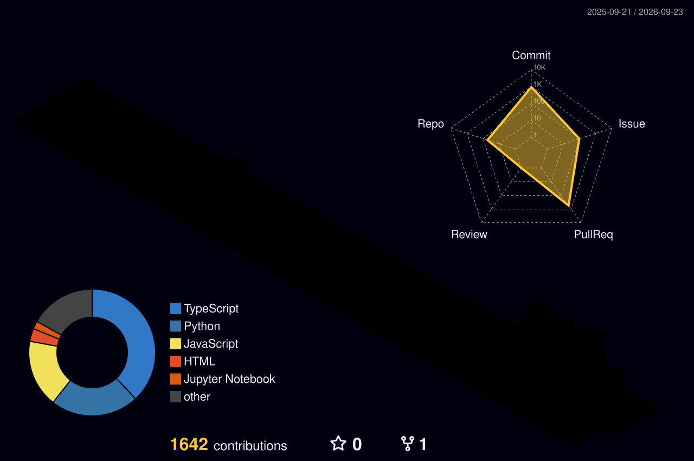

✨ **Fully custom-built profile engine** • Optimized for instant load and responsive 3D renders.

 

 

<table width="100%">
<tr>
<td width="30%" align="center" valign="middle">

</td>
<td width="70%" valign="top">

### 🖋️ Executive Summary
> **I don't build software just to check a box. I design systems that work when real-world scale and deadlines collide.**

I focus on bridging the gap between theoretical artificial intelligence and practical, production-ready engineering. From computer-vision diagnostics in the field to agent-native memory infrastructures, my code is written to survive the transition from my local machine to the end-user.

Currently specializing in **AI & Data Science** via **iHUB DivyaSampark (IIT Roorkee)**, with a proven track record in national hackathons and deploying clean, full-stack architectures.

</td>
</tr>
</table>

 

 

🛸 <b>Commit Engine Status</b> • Live contribution snake eating away at code blocks in real time.

 

💡 <b>3D Contribution Space</b> • Contribution matrix generated dynamically based on active commits to public and private repositories.

## 🧭 Operational Matrix

| 🔭 Building | 🌱 Researching | 🎯 Hunting For | 💬 Ask Me About |
| :--- | :--- | :--- | :--- |
| **Money Tracker** &amp; **Trustflow AI** | Generative AI, MLOps, Vertex AI | AI &amp; MLOps Internships | Computer Vision pipelines, LLM agent design, neural optimization |

## 🎓 The Academic Core

<table width="100%">
  <tr>
    <td width="25%"><b>🎓 Program</b></td>
    <td>Professional Certification in AI &amp; Data Science</td>
  </tr>
  <tr>
    <td><b>🏫 Institution</b></td>
    <td><b>iHUB DivyaSampark, IIT Roorkee</b></td>
  </tr>
  <tr>
    <td><b>🇮🇳 Authority</b></td>
    <td>National Mission on Interdisciplinary Cyber-Physical Systems (NM-ICPS), Government of India</td>
  </tr>
  <tr>
    <td><b>📚 Focus Areas</b></td>
    <td>Deep Learning Models · Statistical Inference · Predictive Pipelines · System Architecture</td>
  </tr>
  <tr>
    <td><b>🔬 Application</b></td>
    <td>Computer Vision diagnostics, NLP classifiers, and robust MLOps deployments</td>
  </tr>
</table>

## 🧠 Technological Stack

⚡ <b>Console Grid</b> • Hovering and glowing node layout visualizing languages, deep learning runtimes, and MLOps platforms.

## 🚀 Featured Deployments

📂 <b>Interactive Project Panel</b> • Visualizing full architectures, data flow verified status, and model evaluation diagnostics.

### 📖 Project Walkthrough &amp; Repositories

*   **🌱 [AI Plant Doctor](https://github.com/Ayush-0918/AI-Plant-Doctor)** — Computer vision tool identifying plant leaf diseases to generate dynamic treatments for farmers. *Ranked #4/150+ teams and won the Best UI/UX award at Code Crafter 3.0 National Hackathon.* `Python · PyTorch · OpenCV · TypeScript · FastAPI`
*   **💰 [Money Tracker](https://github.com/Ayush-0918/Money_Tracker)** — Full-stack personal finance coach with automated categorization and subscription engine. `FastAPI · Kotlin · Jetpack Compose · PostgreSQL`
*   **🧠 [Memori](https://github.com/Ayush-0918/memori)** — Production-grade agent-native memory infrastructure that abstracts and persists conversational state dynamically. `Python · LLMs`
*   **🏥 [Healthcare SkillUp](https://github.com/Ayush-0918/Healthcare-SkillUp-Notebook)** — Evaluation framework assessing the reliability of LLM pipelines in clinical settings, engineered during HiLabs Workshop. `Jupyter · Pandas`
*   **🤖 [J.A.R.V.I.S.](https://github.com/Ayush-0918/J.A.R.V.I.S)** — Voice-activated conversational automation system built for agent-driven task orchestration. `Python · Speech Recognition`
*   **📊 [Netflix Data EDA](https://github.com/Ayush-0918/Netflix-Data-Visualization-EDA-)** — Exploratory analysis engine analyzing production and distribution trends across global Netflix assets. `Matplotlib · Seaborn · Pandas`

## 🏆 Holographic Achievements Shelf

🏆 <b>Holo Cabinet</b> • Showcase of verified contest placements, industry workshop milestones, and academic honors.

## 📜 Simulations &amp; Credentials

*   **☁️ Google Cloud &amp; Vertex AI** — Generative AI models, Prompt Engineering, Large Language Models, and Responsible AI deployment.
*   **🔬 IBM Professional** — Natural Language Processing &amp; Advanced Computer Vision models.
*   **🏢 Enterprise Simulations** — AWS Solutions Architecture, Deloitte Technology Strategy, Citi Software Engineering, and Tata GenAI Data Analytics.

## 📊 Analytics &amp; Productivity

<table width="100%">
  <tr>
    <td width="50%" align="center">
      
    </td>
    <td width="50%" align="center">
      
    </td>
  </tr>
  <tr>
    <td width="50%" align="center">
      
    </td>
    <td width="50%" align="center">
      
    </td>
  </tr>
</table>

## 🌐 Connect &amp; Collaborate

**Open to AI/ML &amp; Data Science Engineering Internships • Research Collaborations • Hackathon Projects**

